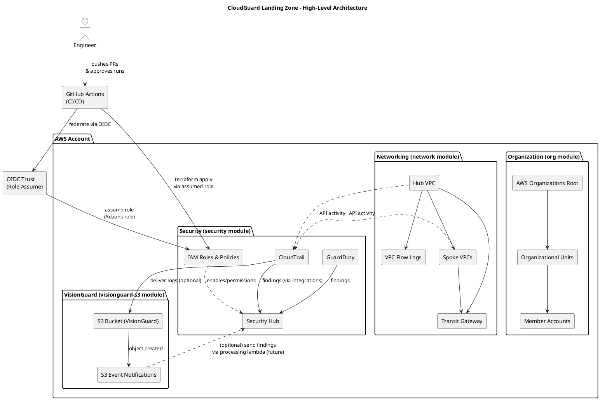
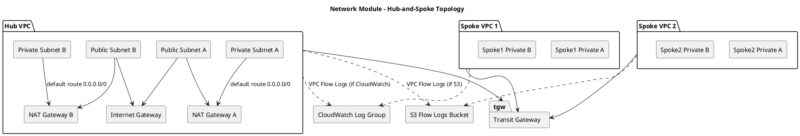
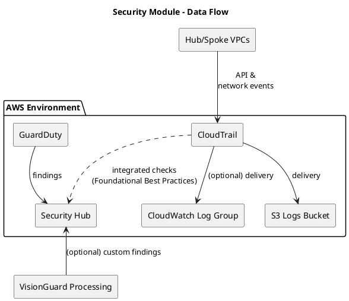

# CloudGuard Landing Zone – Architecture & Module Guide

This document explains the high‑level architecture, the modules that compose the solution, how environments consume those modules, and practical CLI examples. It includes PlantUML diagrams that you can render in VS Code (PlantUML extension) or any PlantUML renderer.

---

## 1) High‑Level Architecture

The diagram below shows all top‑level components and **connects every box** to make relationships explicit.



> **Why a CI/CD + OIDC box?** The framework is typically applied via GitHub Actions using OIDC to assume an AWS role securely (no long‑lived keys).

---

## 2) Network Topology (Hub‑and‑Spoke)

This diagram details how the **network module** lays out the hub, spokes, NAT/IGW, and flow logs destinations.



---

## 3) Security Data Flow

The **security module** enables CloudTrail, GuardDuty, and Security Hub. The flow below clarifies data paths and dependencies.



---

## 4) Module Overviews

### **org module**
**Purpose:** Configure AWS Organizations: root, OUs, and member accounts (or references to existing).  
**Key Resources:** `aws_organizations_organization`, `aws_organizations_organizational_unit`, `aws_organizations_policy_attachment` (SCPs).

### **network module**
**Purpose:** Create a hub‑and‑spoke network with optional Transit Gateway and VPC flow logs.  
**Key Resources:** `aws_vpc`, `aws_subnet`, `aws_internet_gateway`, `aws_nat_gateway`, `aws_ec2_transit_gateway`, `aws_ec2_transit_gateway_vpc_attachment`, `aws_flow_log`, `aws_cloudwatch_log_group`, `aws_iam_role` (for CloudWatch destination).

### **security module**
**Purpose:** Enable centralized detection & visibility.  
**Key Resources:** `aws_cloudtrail`, `aws_guardduty_detector`, `aws_securityhub_account`, `aws_securityhub_standards_subscription`, IAM roles/policies as needed.

### **visionguard-s3 module**
**Purpose:** Provide an S3 bucket and notifications for VisionGuard assets/reports; a foundation for future Lambda processing.  
**Key Resources:** `aws_s3_bucket`, `aws_s3_bucket_notification`, optional Lambda wiring (future enhancement).

---

## 5) How Environments Consume Modules

Each environment folder (e.g., `environments/dev`, `environments/prod`) composes the modules with environment‑specific inputs.

**Example – environments/dev/main.tf (excerpt):**

```hcl
module "org" {
  source               = "../../modules/org"
  organizational_units = ["SecurityTeam", "DevOpsTeam"]
  scp_policies = {
    DenyGlobalServices = "p-57oic78t"
  }
}

module "network" {
  source                        = "../../modules/network"
  prefix                        = "lz-dev"
  hub_vpc_cidr                  = "10.0.0.0/16"
  hub_private_subnet_cidrs      = { "eu-west-1a" = "10.0.1.0/24", "eu-west-1b" = "10.0.2.0/24" }
  hub_public_subnet_cidrs       = { "eu-west-1a" = "10.0.101.0/24", "eu-west-1b" = "10.0.102.0/24" }
  hub_create_internet_gateway   = true
  hub_nat_strategy              = "single"
  create_transit_gateway        = true
  enable_vpc_flow_logs          = true
  flow_logs_destination_type    = "cloudwatch"
  flow_logs_log_group_name      = "/aws/vpc/flowlogs/hub"
  flow_logs_retention_days      = 90
  # flow_logs_kms_key_id        = "arn:aws:kms:eu-west-1:111122223333:key/..." # optional
  tags = { Project = "cloudguard-landingzone", Environment = "dev" }
}

module "security" {
  source                 = "../../modules/security"
  cloudtrail_trail_name  = "cloudguard-trail"
  log_bucket_name        = "aws-cloudguard-logs-eu-west-1"
  enable_guardduty       = true
  enable_security_hub    = true
  aws_region             = "eu-west-1"
}
```

> The **prod** environment mirrors this structure with its own CIDRs, prefixes, and stricter settings (e.g., multi‑AZ NAT or KMS‑encrypted flow logs).

---

## 6) CLI Examples

Run from the environment directory (e.g., `environments/dev`).

```bash
# 1) Initialize (after configuring backend.tf)
terraform init

# 2) Validate & format
terraform fmt -check -recursive
terraform validate

# 3) Plan
terraform plan -out=tfplan.binary

# 4) Apply
terraform apply -auto-approve tfplan.binary
```

**With variable files:**

```bash
terraform plan  -var-file="dev.tfvars"  -out=tfplan.binary
terraform apply -auto-approve tfplan.binary
```

---

## 7) Troubleshooting

| Symptom | Likely Cause | Action |
|---|---|---|
| `No valid credential sources found` | AWS credentials/profile missing in local run or GitHub OIDC not configured | Set `AWS_PROFILE`, run `aws configure`, or verify GitHub OIDC role & trust policy |
| `Unsupported argument` during plan | Module interface drift | Compare `variables.tf` for the module vs your `main.tf` inputs |
| `Error locking state` | Backend S3/DynamoDB missing/mis‑named | Confirm bucket and DynamoDB table exist and match `backend.tf` |
| `AccessDenied` when enabling Security Hub/GuardDuty | Missing IAM permissions in assumed role | Grant necessary `securityhub:*`, `guardduty:*`, `iam:PassRole` as needed |
| `tfsec` flags “public IP subnet” | You intentionally created public subnets | Keep as informational; public subnets must be documented and justified |
| Flow logs not delivered | Destination mis‑set | For CloudWatch: ensure IAM role + log group exist. For S3: ensure bucket policy allows VPC logs delivery |

---

## 8) Notes on Diagram Rendering

If VS Code shows: `⚠️ No PlantUML server, specify one with "plantuml.server"`:  
- Set **PlantUML: Render** to `PlantUMLServer` and **PlantUML: Server** to `https://www.plantuml.com/plantuml` (or run locally with Java + GraphViz).

---

## 9) Change Log Hints (for PRs)

- Add the architecture diagram(s) and ensure all nodes are connected.  
- Confirm module descriptions and environment examples reflect the current code.  
- Include a screenshot of the rendered diagrams in the PR description for reviewers.
